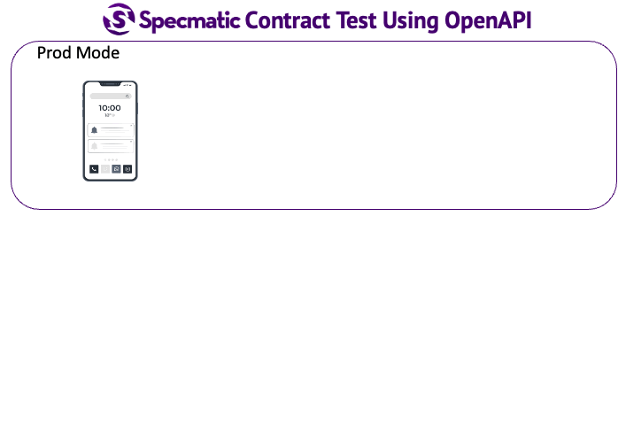

# Specmatic Sample: Springboot BFF calling Domain API

* [Specmatic Website](https://specmatic.io)
* [Specmatic Documentation](https://specmatic.io/documentation.html)

This sample project demonstrates how we can practice contract-driven development and contract testing in a SpringBoot (Kotlin) application that depends on an external domain service and Kafka. Here, Specmatic is used to stub calls to domain API service based on its OpenAPI spec and mock Kafka based on its AsyncAPI spec.

Here is the domain api [contract/open api spec](https://github.com/znsio/specmatic-order-contracts/blob/main/io/specmatic/examples/store/openapi/api_order_v3.yaml)

Here is the [AsyncAPI spec](https://github.com/znsio/specmatic-order-contracts/blob/main/io/specmatic/examples/store/asyncapi/kafka.yaml) of Kafka that defines the topics and message schema.

## Definitions
* BFF: Backend for Front End
* Domain API: API managing the domain model
* Specmatic Stub/Mock Server: Create a server that can act as a real service using its OpenAPI or AsyncAPI spec

## Background
A typical web application might look like this. We can use Specmatic to practice contract-driven development and test all the components mentioned below. In this sample project, we look at how to do this for nodejs BFF which is dependent on Domain API Service and Kafka demonstrating both OpenAPI and AsyncAPI support in specmatic.



## Tech
1. Spring boot
2. Specmatic
3. Specmatic Beta extension (for mocking Kafka)
4. Karate

## Run Tests
This will start the specmatic stub server for domain api and kafka mock using the information in specmatic.json and run contract tests using Specmatic and API Tests using karate.
```shell
./gradlew test
```

# Break down each component to understand what is happening
 
### Start the dependent components
1. Download Specmatic Jar from [github](https://github.com/znsio/specmatic/releases)

2. Start domain api stub server
```shell
java -jar specmatic.jar stub --port=8090
```

3. Start Kafka stub server
```shell
java -jar lib/specmatic-kafka-0.22.5-TRIAL-all.jar --specification=.specmatic/repos/specmatic-order-contracts/io/specmatic/examples/store/asyncapi/kafka.yaml
```

## Start BFF Server
This will start the springboot BFF server
```shell
./gradlew bootRun
```

## Test if everything is working

```shell
curl -H "pageSize: 10" "http://localhost:8080/findAvailableProducts"
```

You result should look like:
```json
[{"id":698,"name":"NUBYR","type":"book","inventory":278}]
```
